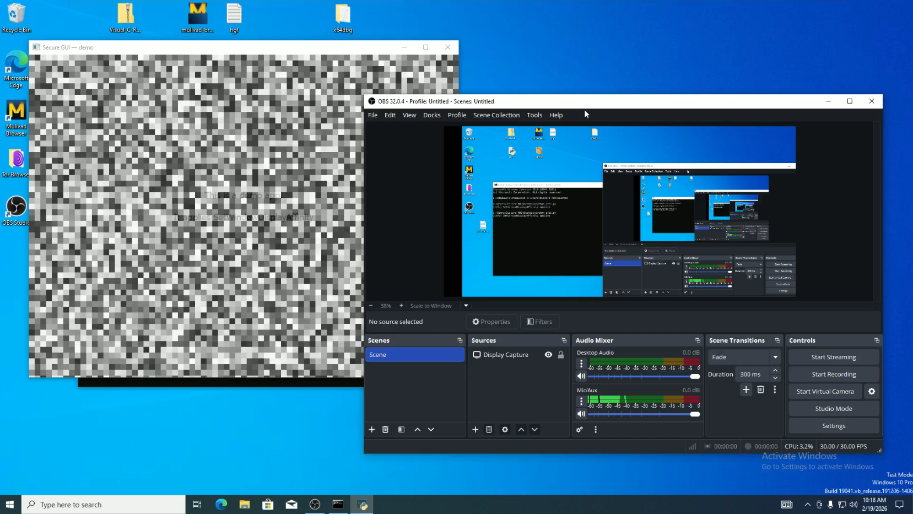
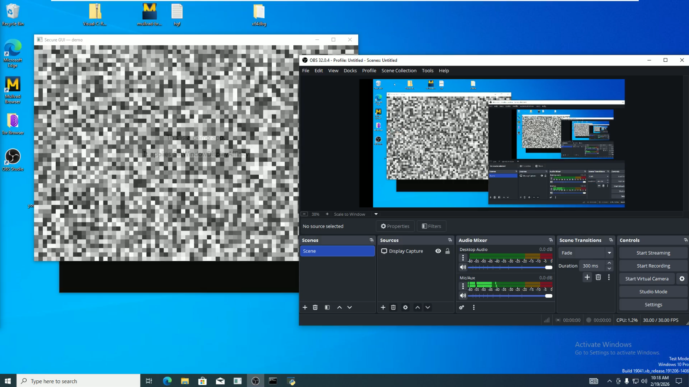

# WDA_HOOK

Using kasperskyhook from ipower to hook window hiding syscalls, pretty much prevents window from hiding itself from capture

Don't expect great code, this was written in a couple nights several months ago.

Cool PoC in theory

full credit to OG creator: https://github.com/iPower/KasperskyHook

Security PoC not intended for malicious use.

Only tested win10 22h2
